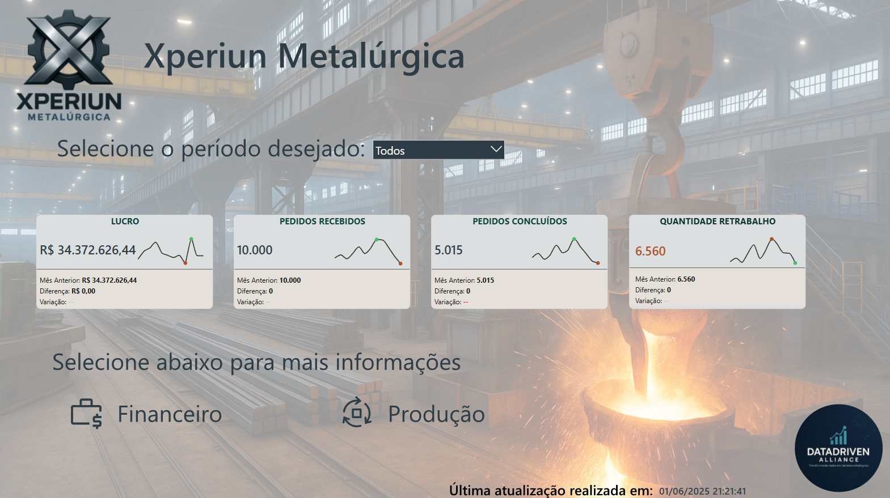

🏭 Xperiun Metalúrgica | Industrial Operations Analytics
Business Intelligence solution focused on industrial production, bottleneck identification, rework cost analysis, and true ROI optimization for a metallurgical plant.

📌 Contexto e Objetivos (Business Problem)
A indústria metalúrgica gera um volume massivo de dados operacionais brutos diariamente. O grande desafio deste projeto foi fornecer visibilidade clara e integrada para as áreas de Produção, Comercial e Diretoria, que sofriam com a falta de rastreabilidade de ineficiências produtivas e impactos financeiros ocultos.

O objetivo central foi mapear os principais indicadores operacionais e financeiros, viabilizando tomadas de decisão ágeis para redução de custos, otimização de tempo de linha e maximização de rentabilidade.

⚙️ Arquitetura da Solução (Architecture)
O projeto unificou a visão de chão de fábrica com a visão executiva através de:

ETL e Tratamento (Power Query): Limpeza de dados operacionais brutos, padronização de registos de falhas e estruturação de bases históricas para análise.

Modelagem de Dados: Arquitetura dimensional (Star Schema) otimizada para cruzar informações de pedidos, materiais, setores e tempo.

Cálculos Avançados (DAX): Criação de métricas de alta complexidade, como Custo de Retrabalho, Tempo Médio por Setor e o Cálculo do ROI Real (expurgando distorções geradas por ineficiências).

UI/UX Design: Desenvolvimento de interface interativa no Figma, permitindo drill-downs intuitivos desde a visão consolidada até ao nível de detalhe do material.

📊 Destaques Visuais (Dashboard Previews)

### 1. Capa do Projeto


### 2. Análise Financeira


💡 Principais Insights Gerados (Key Findings)
O Custo Oculto do Retrabalho: A análise revelou que o ROI global da fábrica estava a ser severamente impactado por custos não mapeados de retrabalho em etapas específicas da produção.

Mapeamento de Gargalos Críticos: Foi possível isolar os materiais específicos que concentravam a maior incidência de falhas, permitindo à engenharia de produção focar ações corretivas direcionadas.

Correlação Complexidade vs. Tempo: O modelo estatístico comprovou a correlação direta entre a complexidade dos pedidos e o tempo de ocupação da linha de produção, viabilizando um planeamento de procura (S&OP) muito mais preciso.

📁 Estrutura do Repositório
```text
📦 xperiun-metalurgica-analytics
┣ 📂 assets/                 👉 Imagens, wireframes e protótipos UI
┣ 📂 docs/                   👉 Relatórios e documentações de negócio
┣ 📂 power_bi/               👉 Ficheiro principal do Dashboard (.pbix)
┗ 📜 README.md               👉 Apresentação do projeto
```
👨‍💻 Autor
Wilderson "Will" Pinto | Business Intelligence & Data Analytics

💼 [Meu Portfólio Notion](https://wise-whippet-9ea.notion.site/Engenharia-de-Dados-e-BI-Transformando-dados-complexos-em-decis-es-de-neg-cios-eaaa0811698d416ea465b87115d2f9ff?pvs=143)

🔗 [Meu LinkedIn](https://www.linkedin.com/in/will-mp)
